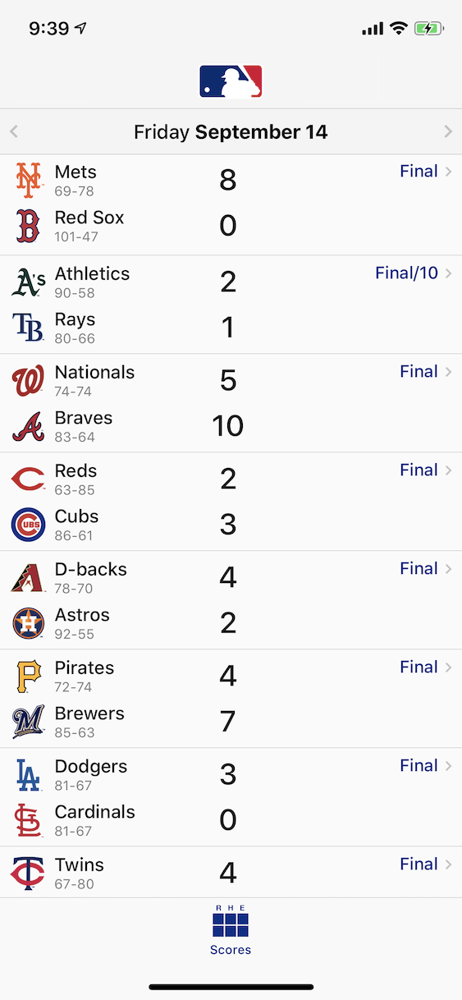

#  MLB iOS Take Home Exercise

## Notes on Building
- Built with UIKit (programmatic), SwiftUI (detail view only), MVVM, Combine, URLSession
- Finished project, with the exception of UI tests (ran out of time for these).  If time I would have recorded UI events using the recorder built in, inside the UI test functions, and manually updated the dates to reflect an expected UI Test result with that specifically.
- Affordances: iPhone/iPad (all orientations), game status edge cases (to catch all I would have asked/collaborated with API engineer and/or team/documentation if available), Dynamic Type (accessibility), Dark/Light Mode from system settings.
- Final thoughts: Found some time to finish this weekend, the project was fun, and this opportunity excites me.  I see things thru to completion.  Thank you.

# Recording


https://user-images.githubusercontent.com/48499265/216962465-44f0cb8d-7389-4cbc-94e4-ded725e0724f.mp4


## Objective
The goal of this exercise is to demonstrate that given:
- A service endpoint that returns structured data in JSON format
- A design mockup

That you can build a working example which demonstrates the following:
- Retrieve serialized JSON data from an endpoint and parse it into a data structure
- Use that deserialized data in a visualized User Interface that presents the information to the user of the app in a meaningful way

## Problem Description
The Baseball Data backend team has provided a new endpoint that provides the scoreboard data for Major League Baseball, based on a given date parameter:

```
https://statsapi.mlb.com/api/v1/schedule?hydrate=team(league),venue(location,timezone),linescore&date=2018-09-19&sportId=1,51&language=en
```

Meanwhile, the design team has provided a mockup of what they would like the scoreboard view to look like:



## Tasks
Create a User Interface that displays the information provided by the JSON endpoint with the following:
- A view displaying all the games and their current score for a given date
- A means for the user to navigate to a specific date via a date picker accessible from the header, as shown in the mockup
- The list of games should be sorted by the start time of the game as provided in the data
- Each game in the list should display:
  - On the left: the two teams playing, always starting with the 'away' team followed by the 'home' team
  - In the middle: each team's name and score
  - On the right: the state of the game:
    - For games that have not yet started, show the starting time
    - For games that are in progress, show the current inning
    - For games that have already completed, show the word `Final`
    - If a game was completed in more or fewer than the usual nine innings, show `F/#` where the # is the number of innings played (e.g. `F/6` or `F/10`)
- Tapping a game in the list should display a detailed view of the game.  The choice of which data elements to display in the detail view, as well as the layout of those elements, are entirely up to you.

Notes:
  - The app should work on both iPhone and iPad.  The vast majority of our users are on iPhones, which is why only an iPhone mockup is provided.  The UI/layout choices for the iPad version are up to you. 
  - Image assets are not provided - all images depicted in the mockup may be omitted from the app.
  - The font faces, sizes and colors should approximate the mockup, but need not be exact.
